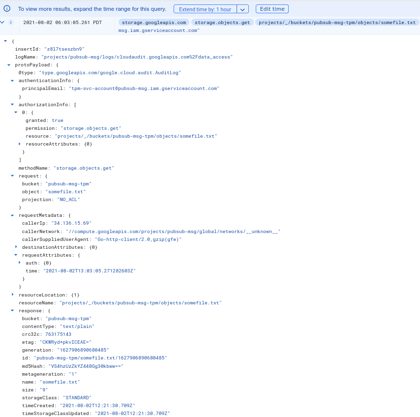
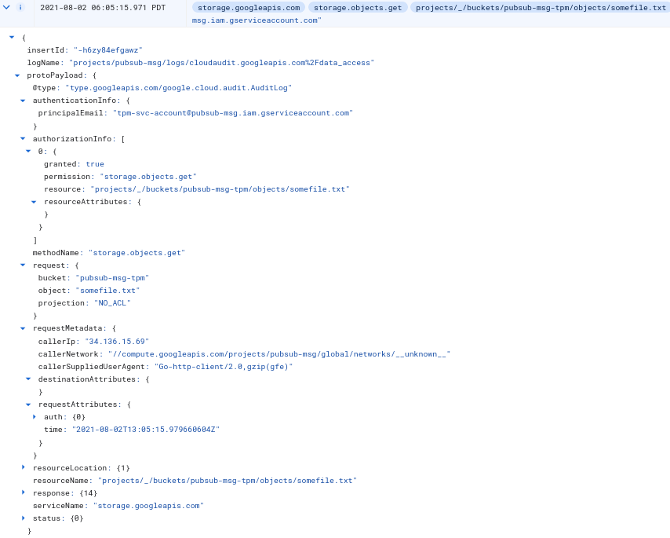
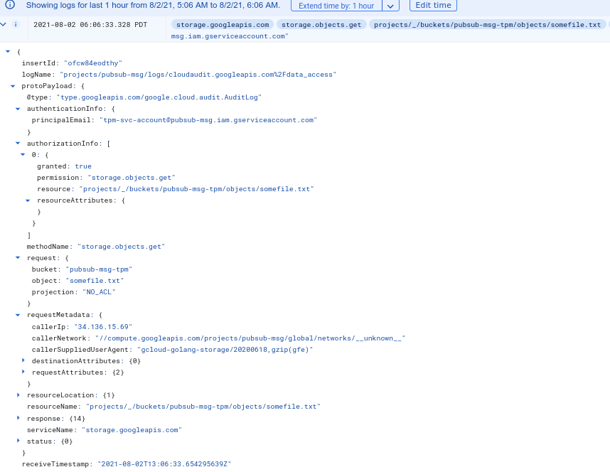

# GCS signedURLs and GCP Authentication with Trusted Platform Module

Samples in golang that enables the following where the private key or hmac secret is embedded with a TPM (Trusted Platform Module)

1. HMAC SignedURLs:  
   - Import a GCS HMAC secret and use it to generate a SignedURL
2. RSA SignedURL: 
   - Generate an a new RSA Private Key on a TPM
   - Use RSA Private Key on TPM to create either:
     - a) Certificate Signing Request (CSR) for signing by another CA
     - b) Self Signed x509 Certificate
   - Associate Certificate with a ServiceAccount
   - Generate SignedURL using TPM
   - Access GCS Object
3. Oauth2 AccessToken
   - Generate Certificate on TPM (step2)
   - Generate GCP oauth2 token using TPM based service account
   - Access GCS using google-cloud-storage library

---

>> this repository is not supported by Google

## References

- [AWS v4 Signer for embedding Access Secrets to PKCS11 and TPMs](https://github.com/salrashid123/aws_hmac)

- [TPM TokenSource for GoogleCloud](https://github.com/salrashid123/oauth2#usage-tpmtokensource)
  golang `TokenSource` which derives GCP Oauth2 and JWTAccessTokens from a TPM for use with GCP Client libraries
- [TPM AccessTokens using Openssl TPM library](https://github.com/salrashid123/tpm2_evp_sign_decrypt)
  Create oauth2 and jwtaccess tokens using TPM support with openssl
- [TPM based golang crypto.Signer](https://github.com/salrashid123/signer)
- [Import Service Account .p12 to TPM:](https://github.com/salrashid123/oauth2#a-import-service-account-p12-to-tpm)
- [Generate key on TPM and export public X509 certificate to GCP](https://github.com/salrashid123/oauth2#b-generate-key-on-tpm-and-export-public-x509-certificate-to-gcp)
- [Importing an external RSA key](https://github.com/salrashid123/tpm2/tree/master/tpm_import_external_rsa)
- [TPM to TPM secret Transfers](https://github.com/salrashid123/tpm2/tree/master/tpm2_duplicate):
  Use to transfer a wrapped HMAC or RSA key from one TPM to another

- [Signed URLs Options](https://cloud.google.com/storage/docs/access-control/signed-urls#types)
- [GCS HMAC Keys](https://cloud.google.com/storage/docs/authentication/hmackeys)


- [Creating GCS HMAC Signed URLs](https://medium.com/google-cloud/gcs-hmac-signedurl-3166b995f237)

- [Examples of the complete Signature Version 4 signing process (Python)](https://docs.aws.amazon.com/general/latest/gr/sigv4-signed-request-examples.html)

## Setup

Create GCS Bucket, object and Service Account and HMAC key to test with

```bash
export PROJECT_ID=`gcloud config get-value core/project`
export PROJECT_NUMBER=`gcloud projects describe $PROJECT_ID --format='value(projectNumber)'`

# create a gcs bucket and object
gsutil mb gs://$PROJECT_ID-tpm
echo -n "some text" > somefile.txt
gsutil cp somefile.txt gs://$PROJECT_ID-tpm

# create a service account that has access to a bucket
# the private key on the TPM will be associated with this service account
gcloud iam service-accounts create tpm-svc-account --project $PROJECT_ID
gcloud iam service-accounts keys list --iam-account tpm-svc-account@$PROJECT_ID.iam.gserviceaccount.com

# allow the service account access to the bucket
gsutil iam ch serviceAccount:tpm-svc-account@$PROJECT_ID.iam.gserviceaccount.com:objectViewer gs://$PROJECT_ID-tpm

# remember the hmac key and secret
gsutil hmac create tpm-svc-account@$PROJECT_ID.iam.gserviceaccount.com
    Access ID:   GOOG1EJBAWIATBBMPW5SNXGTKD6QTQPNJ3MDJXGGGQTJ6PYQQ3I4UGWIZYHBQ
    Secret:      ...redacted...

gsutil hmac list -p $PROJECT_ID

# Create a VM with a TPM
gcloud compute  instances create tpm-test \
   --image=family=debian-11--image-project=debian-cloud  \
  --machine-type "n1-standard-1"  \
  --shielded-secure-boot --shielded-vtpm --shielded-integrity-monitoring  \
  --zone us-central1-a

# ssh to the VM
gcloud compute ssh tpm-test --zone us-central1-a
```

On VM:

```bash
sudo su -
apt-get update -y
apt-get install wget curl git -y

# install golang 1.20+ https://golang.org/doc/install
## *optionally* install tpm2_tools https://tpm2-tools.readthedocs.io/en/latest/INSTALL/

# get the source
git clone https://github.com/salrashid123/gcs_tpm.git
cd gcs_tpm
```

### HMAC

Embed the HMAC key into the TPM

```bash

# first import the hmac secret to the TPM
go run main.go --mode=import --hmacSecret="hmac_secret_from_setup" 

# now use the TPM to generate a signedURL and download the file
go run main.go --mode=sign \
   --hmacKey="GOOG1EJBAWIATBBMPW5SNXGTKD6QTQPNJ3MDJXGGGQTJ6PYQQ3I4UGWIZYHBQ" \
   --bucketName="$PROJECT_ID-tpm" --objectName="somefile.txt"
```

At this point the hmac key is embedded into the TPM with set TPM attributes

```golang
		public := tpm2.Public{
			Type:       tpm2.AlgKeyedHash,
			NameAlg:    tpm2.AlgSHA256,
			AuthPolicy: []byte(defaultPassword),
			Attributes: tpm2.FlagFixedTPM | tpm2.FlagFixedParent | tpm2.FlagUserWithAuth | tpm2.FlagSign, // | tpm2.FlagSensitiveDataOrigin
			KeyedHashParameters: &tpm2.KeyedHashParams{
				Alg:  tpm2.AlgHMAC,
				Hash: tpm2.AlgSHA1,
			},
		}
```

You can also set TPM Policies that govern how to access the key (eg, passwordPolicy, PCR Policy, etc)

If you want to use [tpm2_tools](https://github.com/tpm2-software/tpm2-tools), note that  tpm support was added in with [Issue 1597](https://github.com/tpm2-software/tpm2-tools/issues/1597)



### Service Account RSA

The following will create an RSA private key on the tpm and then use that to create a Certificate Signing Request (CSR) *and* a self-signed x509 Certificate.  The CSR is NOT used in this sample but could be used by an external CA to sign.  For this repo, we will use the TPM based RSA key to self-sign a certificate. 

Since this procedure uploads a key, your organization policy should allow `type: constraints/iam.disableServiceAccountKeyUpload`

```bash
# generate the 509
go run svcaccount/main.go  --mode=gencert --cn=tpm-svc-account@$PROJECT_ID.iam.gserviceaccount.com

# this will generate the cert file at `x509cert.pem`
# copy x509cert.pem to laptop

# on LAPTOP, upload the 509 cert and associate it with a service account
gcloud iam service-accounts keys upload x509cert.pem --iam-account=tpm-svc-account@$PROJECT_ID.iam.gserviceaccount.com

gcloud iam service-accounts keys list --iam-account tpm-svc-account@$PROJECT_ID.iam.gserviceaccount.com
    KEY_ID                                    CREATED_AT            EXPIRES_AT
    4909a11e0a0793f7daba01958a93e67c34cddff6  2021-08-02T12:52:00Z  2022-08-02T12:52:00Z   <<< TPM based service account
    1155f398f6bf840e84a9e16effa35aceca6f45a8  2021-08-02T12:26:22Z  2023-08-25T01:58:04Z

# on VM
# A) generate a signedURL and access the object
go run svcaccount/main.go  --mode=genurl --cn=tpm-svc-account@$PROJECT_ID.iam.gserviceaccount.com --bucketName=$PROJECT_ID-tpm --objectName=somefile.txt

# B) use the TPM's private key to generate a GCP oauth access_token
go run svcaccount/main.go  --mode=useclient  --cn=tpm-svc-account@$PROJECT_ID.iam.gserviceaccount.com --bucketName=$PROJECT_ID-tpm --objectName=somefile.txt
```

with SignedURL


with oauth2 token


---

### Using Attestation Key

You can also use the Attestation Signing Key to sign the url or for an auth token.

see [go-tpm-tools.client](https://pkg.go.dev/github.com/google/go-tpm-tools@v0.3.0-alpha/client#AttestationKeyRSA)

```golang
   // note this key is on  OWNER 

		kk, err = client.AttestationKeyRSA(rwc)
		if err != nil {
			fmt.Fprintf(os.Stderr, "can't AK %q: %v", tpmPath, err)
			os.Exit(1)
      }
      
// GceAttestationKeyRSA generates and loads the GCE RSA AK. Note that this function will only work on a GCE VM. Unlike AttestationKeyRSA, this key uses the Endorsement Hierarchy and its template loaded from GceAKTemplateNVIndexRSA.

// ```bash
// gcloud compute instances get-shielded-identity tpm-test --zone us-central1-a --format="value(signingKey.ekPub)"
// ```


		kk, err = client.GceAttestationKeyRSA(rwc)
		if err != nil {
			fmt.Fprintf(os.Stderr, "can't AK %q: %v", tpmPath, err)
			os.Exit(1)
		}

		pubKey := kk.PublicKey().(*rsa.PublicKey)
		akBytes, err := x509.MarshalPKIXPublicKey(pubKey)
		if err != nil {
			fmt.Fprintf(os.Stderr, "ERROR:  could not get MarshalPKIXPublicKey: %v", err)
			os.Exit(1)
		}
		akPubPEM := pem.EncodeToMemory(
			&pem.Block{
				Type:  "PUBLIC KEY",
				Bytes: akBytes,
			},
		)
```

Either way, you should have a go-tpm-tools Key object which you should persist.  Later on, you will load this Key and use it for Signing.

### Appendix

The equivalent commands using openssl-tss engine to that will generate and embed hmac and RSA keys are

- RSA

```bash
# verify TPM support
openssl engine -t -c tpm2tss
# generate a private key on TPM
tpm2tss-genkey -a rsa private.tss
# generate CSR
openssl req -new -out csr.pem -engine tpm2tss -keyform engine  -key private.tss
# generate self-signed certificate
openssl req -new -x509 -engine tpm2tss -key private.tss -keyform engine -out public.crt  -subj "/C=US/ST=California/L=Mountain View/O=Acme Co/OU=Enterprise/CN=OURServiceAccountName@PROJECT_ID.iam.gserviceaccount.com"
# extract RSA publickey from certificate
openssl x509 -pubkey -noout -in public.crt  > public.pem
# print certificate
openssl x509 -in public.crt -text -noout
# start SSL listener using TPM-based private key
openssl s_server -cert public.crt -key private.tss -keyform engine -engine tpm2tss -accept 50051
```

- HMAC

```bash
export secret="key"
export plain="The quick brown fox jumps over the lazy dog"

echo -n $secret > hmac.key
hexkey=$(xxd -p -c 256 < hmac.key)
echo $hexkey

echo -n $plain > data.in

openssl dgst -sha256 -mac hmac -macopt hexkey:$hexkey data.in
   HMAC-SHA256(data.in)= f7bc83f430538424b13298e6aa6fb143ef4d59a14946175997479dbc2d1a3cd8
   

tpm2 createprimary -Q -G rsa -g sha256 -C e -c primary.ctx

tpm2 import -C primary.ctx -G hmac -i hmac.key -u hmac.pub -r hmac.priv
tpm2 load -C primary.ctx -u hmac.pub -r hmac.priv -c hmac.ctx

echo -n $plain | tpm2_hmac -g sha256 -c hmac.ctx | xxd -p -c 256
    f7bc83f430538424b13298e6aa6fb143ef4d59a14946175997479dbc2d1a3cd8
```


